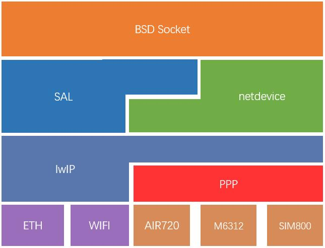

# PPP Device

## 1. 简介

PPP Device 软件包，是 RT-Thread 针对不同模块的 lwIP PPP 功能实现的软件包。它使蜂窝模块不再需要发送 AT 命令，使用 PPP 方式即可实现网络数据传输。

PPP Device 软件包特点如下：

- 支持多种蜂窝模块；
- 无缝兼容多种应用层网络协议（HTTP、MQTT、TLS 等）；
- 支持数据差错检测，提供可靠数据传输；

* 提供 CHAT 方式初始化功能，方便设备移植；

目前 PPP 功能支持 Luat Air720，Quectel EC20，China mobile M6312,  SIMCOM SIM800 模块，后续会接入更多蜂窝模块。


对 PPP Device 有疑惑，或者对 PPP Device 感兴趣的开发者欢迎入群详细了解。

QQ群：749347156 [<传送门>](https://jq.qq.com/?_wv=1027&k=5KcuPGI)

移植文档地址：[<移植文档>](./docs/port.md)

### 1.1 框架图



- ppp_device 软件包是 lwIP 协议栈中 ppp 功能针对不同设备的具体实现；
- ppp_device 软件包中实现 netdev 网卡设备，并对接 SAL 抽象层，应用层可直接使用 BSD Socket API 进行网络编程；

### 1.2 目录结构

| 名称 | 说明 |
| ---- | ---- |
| src | PPP Device 实现源码目录 |
| inc | PPP Device 头文件目录 |
| sample | PPP 功能示例文件目录 |
| class | 不同设备针对 PPP 功能的移植适配目录 |

### 1.3 许可证

ppp_device 软件包遵循 Apache-2.0 许可，详见 LICENSE 文件。

### 1.4 依赖

- RT-Thread 3.1.0+
- lwIP 组件（ ppp 功能）

## 2. 获取方式

**PPP Device 软件包相关配置选项介绍**


```c
[*] PPP DEVICE: lwIP PPP porting for Cellular Module( 2G/3G/4G )
    [ ]   Enable debug log output
    [ ]   Enbale authorize connect feature
    [*]   Enable link status detect feature
    (10)     Link status detecct timeout
          Select Internet Service Provider (china mobile)  --->
          Select modem type (Luat Air720)  --->
    [*]    Enable ppp device sample
    (uart3) ppp device uart name
          Version (latest)  --->
```
- **Enable debug log output:** 开启调试日志功能
- **Enbale authorize connect feature:** 开启身份认证功能
- **Enable lin status detect feature:** PPP链路连接监控，检测链路连接正常；设置为 0 则不开启链路监控；
- **Select modem type:** 模块选择
- **Select Internet Service Provider:** 网络运营商选择
- **Enable ppp device sample:**  选择模块后会提示的模块使用示例
- **ppp device uart name:** 模块使用的串口
- **Version:** 软件包版本号

## 3. 使用方式

PPP Device 软件包初始化函数如下所示：

**PPP 功能启动函数，该函数自动调用；没有调用停止函数前，不可再次调用**

```c
int ppp_sample_start(void)
{
    rt_device_t device = RT_NULL;
    device = rt_device_find(PPP_DEVICE_NAME);
    if(device == RT_NULL)
    {
        LOG_E("Can't find device (%s).", PPP_DEVICE_NAME);
        return -RT_ERROR;
    }
    if(ppp_device_attach((struct ppp_device *)device, PPP_CLIENT_NAME, RT_NULL) != RT_EOK)
    {
        LOG_E("ppp_device_attach execute failed.");
        return -RT_ERROR;
    }
    return RT_EOK;
}
// 自动初始化
INIT_APP_EXPORT(ppp_sample_start);
// 命令导出到MSH( ppp_sample_start 变更为ppp_start )
MSH_CMD_EXPORT_ALIAS(ppp_sample_start, ppp_start, a sample of ppp device  for dailing to network);
```

* 模块拨号，模块进入 PPP 模式；
* 注册 netdev 设备，接入标准网络框架；

**PPP 功能停止函数，该函数可以退出 PPP 模式**

```c
int ppp_sample_stop(void)
{
    rt_device_t device = RT_NULL;
    device = rt_device_find(PPP_DEVICE_NAME);
    if(device == RT_NULL)
    {
        LOG_E("Can't find device (%s).", PPP_DEVICE_NAME);
        return -RT_ERROR;
    }
    if(ppp_device_detach((struct ppp_device *)device) != RT_EOK)
    {
        LOG_E("ppp_device_detach execute failed.");
        return -RT_ERROR;
    }
    return RT_EOK;
}
MSH_CMD_EXPORT_ALIAS(ppp_sample_stop, ppp_stop, a sample of ppp device for turning off network);
```

* 退出 PPP 模式，模块退出拨号模式；
* 解注册 netdev 设备；

模块上电后，自动初始化流程如下：

```c
 \ | /
- RT -     Thread Operating System
 / | \     4.0.2 build Sep 23 2019
 2006 - 2019 Copyright by rt-thread team
lwIP-2.0.2 initialized!
[I/sal.skt] Socket Abstraction Layer initialize success.
[I/ppp.chat] (uart3) has control by modem_chat.
[I/ppp.dev] (uart3) is used by ppp_device.
msh />[I/ppp.dev] ppp connect successful.
```

设备上电初始化完成，模块提示拨号成功，然后可以在 FinSH 中输入命令 `ifconfig` 查看设备 IP 地址、MAC 地址等网络信息，如下所示：

```shell
msh />ifconfig
network interface device: pp (Default)           ## 设备名称
MTU: 1500                                        ## 网络最大传输单元
MAC: 95 45 68 39 68 52                           ## 设备 MAC 地址
FLAGS: UP LINK_UP INTERNET_DOWN DHCP_DISABLE     ## 设备标志
ip address: 10.32.76.151                         ## 设备 IP 地址
gw address: 10.64.64.64                          ## 设备网关地址
net mask  : 255.255.255.255                      ## 设备子网掩码
dns server #0: 114.114.114.114                   ## 域名解析服务器地址0
dns server #1: 120.196.165.7                     ## 域名解析服务器地址1
```

获取 IP 地址成功之后，如果开启 Ping 命令功能，可以在 FinSH 中输入命令 `ping + 域名地址` 测试网络连接状态， 如下所示：

```shell
msh />ping www.baidu.com
60 bytes from 183.232.231.172 icmp_seq=0 ttl=55 time=84 ms
60 bytes from 183.232.231.172 icmp_seq=1 ttl=55 time=78 ms
60 bytes from 183.232.231.172 icmp_seq=2 ttl=55 time=78 ms
60 bytes from 183.232.231.172 icmp_seq=3 ttl=55 time=78 ms
```

`ping` 命令测试正常说明 PPP Device 设备网络连接成功，之后可以使用 SAL（套接字抽象层） 抽象出来的标准 BSD Socket APIs 进行网络开发（MQTT、HTTP、MbedTLS、NTP、Iperf 等）。

## 4. 注意事项

* 一般的 SIM 卡因为只能从运营商网络获取内网地址，所以一般不能实现服务器相关功能
* 特殊的 SIM 卡可以从运营商获取公网地址，可是实现服务器功能
* 目前只支持一个设备通过 PPP 连接网络
* 建议不要打开 RT_DEVICE_FLAG_DMA_TX
* 如果网络环境不好，建议关闭 Enable lin status detect feature 选项，或调整成大一点的时间
* RT_LWIP_TCPTHREAD_STACKSIZE 需要配置为不小于 2048，及时在 network 组件中修改
* 不要忘记打开串口
* 对于开启模块电源控制引脚的开发者，要注意模块的启动时间；通常模块启动时间较长，这时会出现长时间拨号不成功的问题，一定要注意模块的启动时间，避免造成使用上的一些障碍。

## 5. 联系方式

联系人：xiangxistu

Email: liuxianliang@rt-thread.com

## 6. 致谢

感谢网友 [@xfan1024](https://github.com/xfan1024) 的一些贡献及建议，在制作PPP DEVICE 时给与的帮助。提出了很多宝贵的意见来一同完善PPP DEVICE 软件包。