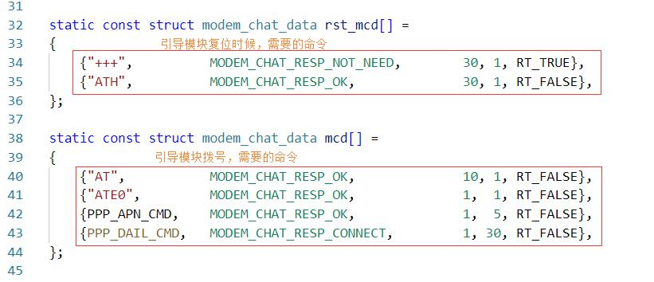
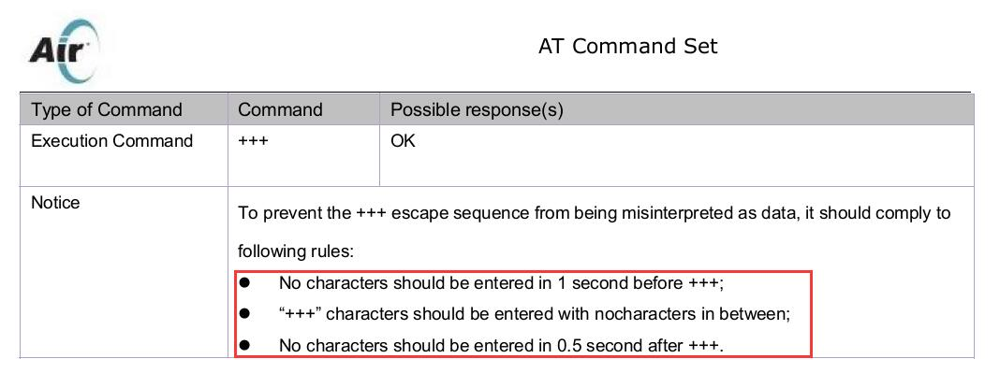
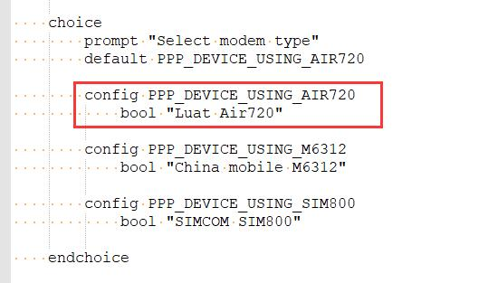

# 模块移植

得益于大佬的指导，PPP_DEVICE 的模块功能解耦做得很好；

对于新模块的支持，只需要修改 class 文件夹下的文件即可。

以添加 Air720 模块为例，从模块的添加到提交到 github 上，**整体来说分为三个部分：**

#### 1. 在 class 下添加 ppp_device_air720.c 文件

*ps : 从 class 文件夹下选择任意一个文件重命名也行*



在设置引导模块复位命令的时候，需要着重注意 +++ 命令，这里需要查看对应模块的 AT 命令手册；



手册中明确要求，+++ 命令在命令输入前 1 秒不能有数据输入，在发送 +++ 命令后有 0.5 秒不能有数据输入；

也就是说，我们需要设置这条命令为

```c
{"+++",          MODEM_CHAT_RESP_NOT_NEED,        30, 1, RT_TRUE},
```

如果 AT 手册没有明确要求这样的操作，可以写成

```c
{"+++",          MODEM_CHAT_RESP_NOT_NEED,        30, 1, RT_FLASE},
```

这两者的区别就是，在发送完成 +++ 命令后会不会发送 '\r' 结束符；

**因为 AT 命令普遍要求结束符，但恰巧 +++ 命令较为特殊**，所以需要特别注意。

ATTENTION：

**MODEM_CHAT_RESP_NOT_NEED**，表示发送该条命令需不需要回复，看个人需求选择需要等待回复的内容

现在回复内容的判断有以下支持：

```c
MODEM_CHAT_RESP_OK,         "OK"
MODEM_CHAT_RESP_READY,      "READY"
MODEM_CHAT_RESP_CONNECT,    "CONNECT"
MODEM_CHAT_RESP_BUSY,       "BUSY"
MODEM_CHAT_RESP_NO_CARRIER, "NO CARRIER"
MODEM_CHAT_RESP_ERROR,      "ERROR"
MODEM_CHAT_RESP_NOT_NEED
```

如果模块重启时间很短，在几秒时间左右，可以添加软重启支持（当然需要查看 AT 手册看看命令是什么）

```c
{"AT+RESET",          MODEM_CHAT_RESP_NOT_NEED,        30, 1, RT_FLASE},
```

因为 Air720 的模块重启时间比较长在 20s 左右，所以没有添加。


剩下的**修改**一下**函数名称**，**宏定义**设置什么的，新模块就已经支持了。

#### 2. 修改 SConscirpt 脚本

在合适位置添加

```c
# Air720
if GetDepend(['PPP_DEVICE_USING_AIR720']):
    src += Glob('class/ppp_device_air720.c')
```

命令格式尽量统一，提交 PR 时候也提升效率

#### 3. 修改 package 的索引

这里主要是修改 Kconfig 文件，添加 env 对新模块的支持

文件路径 

> env\packages\iot\ppp_device\Kconfig



在合适的位置添加

```c
config PPP_DEVICE_USING_AIR720
    bool "Luat Air720"
```

如果命名格式统一的话，这里也不用太费脑筋

**ATTENTION：**修改 env 下的可能会导致更新出现问题，实验时候修改的数据最好做好备份及时还原；


## 欢迎大家 PR ，一起实现更多模块支持

* PR 需要有两个不同的仓库，建议 star 并且 frok
* 更多 PR 信息，可以在群里询问，提交前可以把自己仓库里在群里发一下，大家审阅一下提升代码质量。